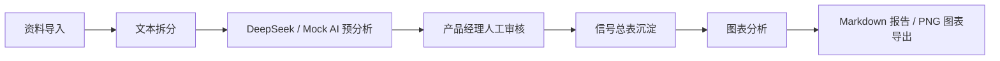

# 地图产品竞品分析 Agent

面向地图与户外产品经理的 AI 用户声音与竞品信号分析工作台。

AI-powered map product intelligence workspace for user feedback, competitor signals, human review, charts, and PM reports.

## 项目简介

这是一个面向地图、出行与户外产品经理的 AI 分析工作台，用于处理应用商城评论、版本更新日志、社区反馈、竞品体验记录等非结构化资料，并将它们转化为可审核、可沉淀、可汇报的产品信号。

本项目不是一个简单的 AI 聊天页面，而是一个围绕产品经理真实工作流设计的 AI 分析工作台。它覆盖从资料导入、文本拆分、AI 预分析、人工审核、信号总表到图表和报告输出的完整闭环。

## 为什么做这个项目

地图产品经理需要长期关注用户评论、竞品更新、社区反馈和体验记录。但这些资料通常分散、重复、上下文不一致，很难稳定沉淀为可追踪的产品洞察。

直接让 AI 总结也有明显问题：结论可能不可复核，分类口径不稳定，证据来源容易丢失，最终很难进入正式周报、月报或需求讨论。因此这个项目采用“AI 先结构化，人再确认，最后形成可信信号与报告”的流程。

## 核心工作流



## 核心功能

### 资料导入

- 支持综合地图、户外专业地图和自定义产品。
- 支持应用商城评论、社区反馈、版本更新日志、官网公告、竞品体验记录等来源。
- 支持单条文本和批量文本导入。
- 支持按空行、分隔线、编号等方式自动拆分多条资料。

### AI 预分析

- 默认使用 DeepSeek 生成正式 AI 预分析。
- Mock AI 保留为无 Key 演示、低成本体验和回归测试兜底。
- 输出产品模块、信号类型、影响程度、核心结论、原文证据、产品启示、建议动作和置信度。

### 人工审核

- `/review` 使用上表下审结构，适合批量审核。
- 支持通过、修改并通过、忽略。
- 只有人工确认后的记录才会进入信号总表和报告中心。

### 信号总表

- 用颜色区分产品、影响程度、建议动作和审核状态。
- 作为后续图表、筛选和报告生成的可信数据源。

### 报告中心

- 支持从正式信号中筛选和勾选记录。
- 基于人工确认信号生成图表分析。
- 支持导出图表 PNG。
- 支持生成适合公司周报、月报和竞品分析文档的 Markdown 报告。

## AI + Human-in-the-loop 设计

系统中的核心约束是：AI 可以提出判断，但最终进入报告的数据必须经过人工确认。

AI 负责把零散文本初步结构化，判断模块、信号类型、影响程度和建议动作；产品经理负责审核、修改和确认。报告中心只读取人工确认后的 `reviewedAnalysis`，避免 AI 直接编造、误判或输出不可追溯结论。

这种设计让 AI 成为产品经理的信息处理助理，而不是替代产品判断的黑盒。

## 技术栈

- Next.js
- React
- TypeScript
- Tailwind CSS
- shadcn/ui
- TanStack Query
- DeepSeek OpenAI-compatible API
- 轻量客户端状态管理 + LocalStorage 持久化
- Markdown report generation
- PNG chart export

## 项目结构

```text
src/app/(workspace)/import      资料导入页
src/app/(workspace)/review      AI 预分析与人工审核
src/app/(workspace)/signals     信号总表
src/app/(workspace)/reports     报告中心
src/services/analysis           AI Prompt、Schema、DeepSeek / Mock 分析
src/services/reports            报告生成与图表统计
src/stores                      客户端状态与持久化
scripts                         回归测试脚本
docs                            产品设计与迭代文档
```

## 本地运行

```powershell
npm ci
npm run dev
```

访问：

```text
http://localhost:3000/import
```

## 环境变量

参考 `.env.example` 创建本地 `.env.local`。不要提交 `.env.local`。

```env
AI_PROVIDER=deepseek
DEEPSEEK_API_KEY=your_deepseek_api_key_here
DEEPSEEK_BASE_URL=https://api.deepseek.com
DEEPSEEK_MODEL=deepseek-v4-flash
ANALYSIS_PROMPT_VERSION=v1
```

未配置 DeepSeek Key 时，可以在 `/review` 手动切换 Mock AI 进行完整流程演示。

## 测试命令

```powershell
npm run test:split
npm run test:mock-analysis
npm run test:analysis-schema
npm run test:report-generator
npm run test:report-metrics
npx tsc --noEmit
npm run build
```

## 演示路径

```text
/import   导入测试资料
/review   使用 DeepSeek 或 Mock AI 分析
/review   人工通过、修改或忽略信号
/signals  查看正式信号总表
/reports  勾选信号，查看图表
/reports  导出 PNG 图表与 Markdown 报告
```

## Screenshots

Coming soon.

## 开源底座与个人贡献边界

项目基于开源 Next.js + shadcn dashboard starter 搭建，保留了通用 UI、布局、主题和表单等底层能力。

个人主要完成：

- 地图产品情报场景定义。
- 产品经理工作流设计。
- 资料导入与批量文本拆分。
- AI Prompt、Schema 和 DeepSeek 接入。
- Mock AI 分析与回归测试。
- Human-in-the-loop 审核流程。
- 信号总表和状态沉淀。
- 图表与报告中心。
- 项目复盘文档与公开仓库维护。

底座提供工程外壳和基础组件，本项目的业务流程、AI 分析链路、审核机制、报告生成和地图产品情报场景为重新设计与实现。

## 当前限制 / 下一步

- 当前报告由确定性规则生成，不调用 DeepSeek 写报告。
- 当前数据存储为前端本地持久化，未接正式数据库。
- PDF / Word 导出未实现。
- 权限系统和团队协作未接入。
- 后续可扩展到数据库、多用户、团队协作、报告模板、线上部署和评估闭环。
